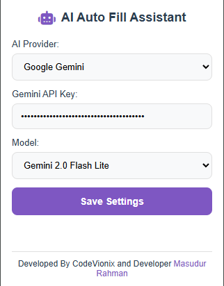
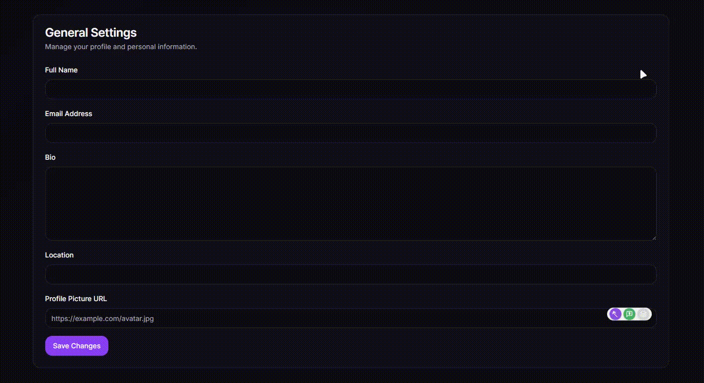

# AI Auto Fill Assistant - Complete Project

## Overview

A comprehensive AI assistant solution with **two powerful applications**:

1. **🌐 Chrome Extension** - Smart AI assistant for web forms and input fields
2. **🖥️ Windows Desktop App** - Professional floating AI assistant for Windows

Both applications provide seamless access to multiple AI providers (OpenAI, Gemini, Claude) with modern, intuitive interfaces.

## 📦 Applications

### 🌐 Chrome Extension

Smart AI assistant that enhances web browsing with intelligent form filling and content generation.

**Key Features:**

- Auto Fill for any input field based on context (Alt+A)
- Ask AI with custom prompts (Alt+Q)
- Content Enhancement for existing text (Alt+E)
- Sleek capsule-shaped UI
- Multi-provider AI support (Gemini, OpenAI, Claude)

### 🖥️ Windows Desktop App ⭐ **NEW!**

Professional floating AI assistant for Windows with modern glassmorphism design.

**Key Features:**

- Always-on-top floating window
- Global keyboard shortcuts (Alt+Space, Alt+A)
- System tray integration
- Dark/light theme support
- Microsoft Store ready (APPX packaging)
- Chat history and settings persistence

## Images

- Loading animations and tooltips for improved user experience
- User-friendly error handling and feedback

## Installation

<!-- ### From Chrome Web Store

1. Visit the [AI Auto Fill Assistant](https://chrome.google.com/webstore/detail/ai-auto-fill-assistant/your-extension-id) on Chrome Web Store
2. Click "Add to Chrome"
3. The extension will be installed and ready to use -->

### Development Mode

1. Download or clone this repository
2. Open Chrome and navigate to `chrome://extensions/`
3. Enable "Developer mode" by toggling the switch in the top-right corner
4. Click "Load unpacked" and select the extension directory
5. The extension should now be installed and ready to use

## Configuration

1. Click on the extension icon in the Chrome toolbar
2. Select your preferred AI provider
3. Enter your API key for the selected provider
4. Choose the AI model you want to use
5. Click "Save Settings"

## Usage

### Auto Fill

1. Click into any input field on a webpage
2. The AI buttons will appear on the right side of the field
3. Click the purple magic wand button to automatically generate content (or use keyboard shortcut Alt+A)
4. The field will be filled with AI-generated content

### Ask AI

1. Click into any input field
2. Click the green chat bubble button (or use keyboard shortcut Alt+Q)
3. Enter your specific request or prompt in the popup
4. Press Enter to generate customized content

### Content Enhancement

1. Write or paste some text into an input field
2. Click the blue enhancement button (or use keyboard shortcut Alt+E) - only active when field has content
3. The AI will improve your text while maintaining its original meaning

## Development

- `manifest.json`: Extension configuration
- `popup.html` & `popup.js`: Settings UI
- `src/content.js` & `src/content.css`: Content script that adds AI buttons to the page
- `src/background.js`: Background script that handles AI API calls

## API Keys

You'll need to obtain API keys from the AI providers you wish to use:

- Google Gemini: https://ai.google.dev/
- OpenAI: https://platform.openai.com/
- Anthropic Claude: https://www.anthropic.com/

## License

MIT License

## Developer

Developed by CodeVionix | Masudur Rahman
